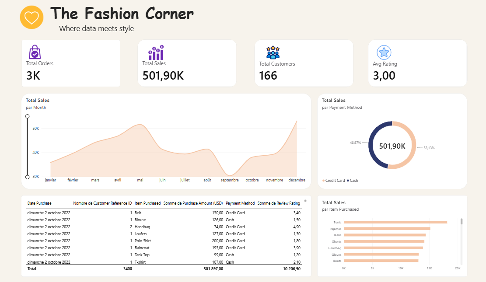

# Fashion Retail Analytics

End-to-end analysis of **3,400 fashion retail transactions** : data cleaning and customer segmentation in **Python**, and an interactive sales dashboard in **Power BI**.


---

## 📊 Dashboard



**The Fashion Corner — Where data meets style.** A single-page Power BI report ([`dashboard/fashion dashboard.pbix`](dashboard/)) built on a `Sales` table and a `DateTable` calendar, fed by the cleaned dataset produced in the notebook (`fashion_retail_clean.csv`):

| Visual | What it shows |
|---|---|
| KPI cards | Total Orders · Total Sales · Total Customers · Avg Rating |
| Line chart | Sales by calendar month |
| Donut chart | Sales share by payment method (Cash vs Credit Card) |
| Bar chart | Sales by item purchased |
| Detail table | Transaction-level drill-down (customer, date, item, payment, amount, rating) |

---

## 🎯 Business questions

1. Where is revenue concentrated: items, categories, payment methods?
2. Which customers are loyal, and which are at risk of churning?
3. How do sales and ratings evolve over the year?
4. What should merchandising and CRM do next?

---

## 🔍 Key findings (Python notebook, cleaned data)

- **166 customers · 3,400 orders · ~$358.7K revenue**, average order ≈ **$105**, ~20 orders per customer. This is a repeat-purchase customer base, not one-time traffic.
- **Tops (~$90.7K) and Accessories (~$88.3K)** are the two leading categories, well ahead of Dresses & sets, Bottoms, Outerwear and Footwear.
- **Payments are balanced**: 51.7% credit card / 48.3% cash by revenue.
- **No strong seasonality:** monthly revenue stays within ~$25K–$32K (December 2022 is the highest at ~$32.4K, but only marginally). October 2023 contains only 5 orders and is excluded from trend conclusions.
- **Best-selling items are evenly spread** (Skirt, Shorts, Pajamas, Blouse, T-shirt each at ~$9K), so no single product dominates.
- **K-Means RFM segmentation (k = 4):** VIP muses (37 customers, ~$104.7K), Loyal regulars (68, ~$153.8K), Steady core (44, ~$70.8K), and **Cooling off (17 customers, ~64 days since last purchase vs ~15 for the others)**, the natural win-back target.

---


## 🗂️ Repository structure

```
fashion-retail-analytics/
├── README.md
├── requirements.txt
├── data/
│   └── Fashion_Retail_Sales.csv        
├── notebooks/
│   └── fashion_retail_analytics.ipynb  
├── dashboard/
│   └── fashion dashboard.pbix          
└── assets/
    └── dashboard.png                   
```


---

## 🚀 Getting started

```bash
git clone https://github.com/sihamaitbaziz/fashion-retail-analytics.git
cd fashion-retail-analytics
pip install -r requirements.txt
jupyter notebook notebooks/fashion_retail_analytics.ipynb
```


## 🛠️ Tech stack

- **Python:** pandas, NumPy, matplotlib, seaborn, scikit-learn (K-Means, StandardScaler)
- **BI:** Power BI Desktop (DAX measures, calendar table, star-style model)
- **Optional:** PostgreSQL via SQLAlchemy

---


